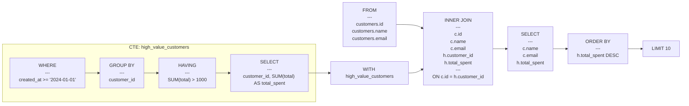
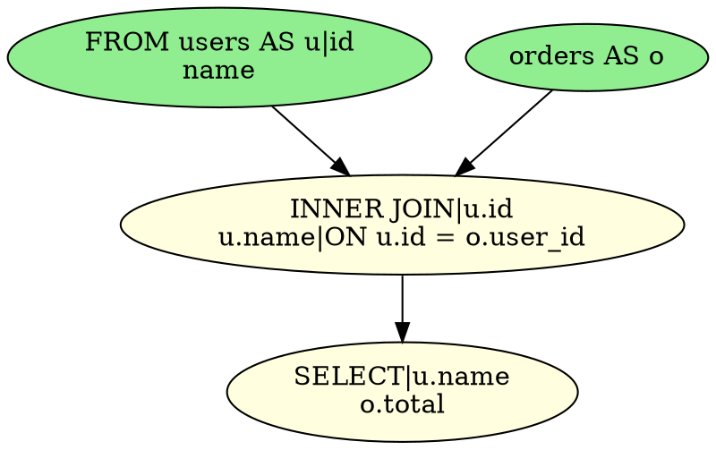

# sqloflow

> 🔍 Visualize SQL queries as beautiful data flow diagrams

Turn your complex SQL queries into intuitive visualizations that show how data flows through each operation!

## ✨ Quick Example

Transform this SQL:
```sql
WITH high_value_customers AS (
  SELECT customer_id, SUM(total) as total_spent
  FROM orders
  WHERE created_at >= '2024-01-01'
  GROUP BY customer_id
  HAVING SUM(total) > 1000
)
SELECT c.name, c.email, h.total_spent
FROM customers c
JOIN high_value_customers h ON c.id = h.customer_id
ORDER BY h.total_spent DESC
LIMIT 10
```

Into this beautiful visual flow:


## 🚀 Features

- 📊 **Column-level data flow tracking** - See exactly which columns flow through each operation
- 🎯 **Multiple output formats** - Mermaid diagrams, ASCII art, GraphViz DOT, or raw JSON
- 🔍 **Intelligent schema inference** - Automatically detects columns even without CREATE TABLE
- 📸 **Schema snapshots** - Track how your data schema transforms at each step
- 🌐 **Universal compatibility** - Works in browsers, Node.js, and as a CLI tool
- 🗂️ **Complex query support** - CTEs, subqueries, joins, aggregations, and more

## 📦 Installation

```bash
npm install sqloflow
```

Or use it globally as a CLI:
```bash
npm install -g sqloflow
```

## 🖥️ CLI Usage

### Basic Usage

```bash
# Output Mermaid diagram to stdout
sqloflow "SELECT * FROM users"

# Save to file
sqloflow -o diagram.md "SELECT * FROM users"

# Different output formats
sqloflow -f ascii "SELECT * FROM users"    # ASCII art
sqloflow -f dot "SELECT * FROM users"      # GraphViz DOT
sqloflow -f json "SELECT * FROM users"     # Raw JSON structure

# Read from file
cat query.sql | sqloflow
```

### Options

```
-f, --format <format>     Output format: mermaid, ascii, dot, json (default: mermaid)
-o, --output <file>       Output to file instead of stdout
-d, --dialect <dialect>   SQL dialect: postgresql, mysql, sqlite, mariadb, transactsql
                         (default: postgresql)
-h, --help               Show help message
```

### Real-world Examples

```bash
# Visualize a complex analytical query
sqloflow "
  WITH monthly_sales AS (
    SELECT
      DATE_TRUNC('month', created_at) as month,
      SUM(amount) as total
    FROM orders
    GROUP BY 1
  )
  SELECT
    m.month,
    m.total,
    LAG(m.total) OVER (ORDER BY m.month) as prev_month,
    m.total - LAG(m.total) OVER (ORDER BY m.month) as growth
  FROM monthly_sales m
  ORDER BY m.month DESC
"

# Visualize a JOIN query showing table relationships
sqloflow "SELECT u.name, o.total FROM users u JOIN orders o ON u.id = o.user_id WHERE o.total > 100"

# Generate a GraphViz visualization and convert to PNG
sqloflow -f dot "SELECT * FROM users u JOIN posts p ON u.id = p.user_id" | dot -Tpng -o query.png

# Quick ASCII visualization in terminal
sqloflow -f ascii "SELECT name, COUNT(*) FROM users GROUP BY name"
```

## 📚 Library Usage

### Basic Example

```typescript
import { parse, convert, render } from 'sqloflow';

// Your SQL query
const sql = `
  SELECT u.name, COUNT(o.id) as order_count
  FROM users u
  LEFT JOIN orders o ON u.id = o.user_id
  WHERE u.created_at >= '2024-01-01'
  GROUP BY u.id, u.name
  HAVING COUNT(o.id) > 5
`;

// Parse and convert to intermediate representation
const ast = parse(sql);
const ir = convert(ast);

// Render as Mermaid diagram
const mermaid = render(ir, { format: 'mermaid' });
console.log(mermaid);
```

### Working with Different SQL Dialects

```typescript
import { parse, convert, render } from 'sqloflow';

// MySQL-specific syntax
const mysqlAst = parse(sql, 'mysql');
const ir = convert(mysqlAst);
const result = render(ir, { format: 'mermaid' });
```

### Accessing Schema Information

```typescript
// The IR (Intermediate Representation) contains detailed schema information
const ir = convert(ast);

// Access schema snapshots showing column flow
ir.snapshots?.forEach(snapshot => {
  console.log(`At ${snapshot.nodeId}:`);
  snapshot.schema.columns.forEach(col => {
    console.log(`  - ${col.source}.${col.name} (${col.type || 'unknown'})`);
  });
});
```

## 📊 Output Formats

### Mermaid Diagrams
Perfect for documentation and GitHub READMEs:


### ASCII Art
Great for terminal output with enhanced details:
```
┌────────────┐     ┌─────────────────────┐    ┌───────────────┐    ┌───────────┐    ┌───────────────────────┐
│    FROM    │     │     INNER JOIN      │    │     WHERE     │    │  SELECT   │  ┌▶│ ORDER BY o.total DESC │
│ ─────────  │     │      ─────────      │  ┌▶│   ─────────   │─ ┐ │ ───────── │  │ └───────────────────────┘
│  users.id  │─ ┐  │        u.id         │  │ │ o.total > 100 │  └▶│ u.u.name  │─ ┘
│ users.name │  └┌▶│       u.name        │─ ┘ └───────────────┘    │ o.o.total │
└────────────┘   │ │      ─────────      │                         └───────────┘
                 │ │ ON u.id = o.user_id │
                 │ └─────────────────────┘
┌─────────────┐  │
│ orders AS o │─ ┘
└─────────────┘
```

The ASCII renderer now shows:
- **Column information** for FROM and JOIN operations
- **Formatted WHERE clauses** with AND/OR operators on separate lines
- **Flattened subqueries** displaying their internal structure inline

### GraphViz DOT
For high-quality rendered diagrams:


### JSON Structure
For programmatic access:
```json
{
  "nodes": [
    {
      "id": "node_0",
      "kind": "op",
      "label": "FROM",
      "sql": "users"
    }
  ],
  "edges": [...],
  "snapshots": [...]
}
```

## 🎯 Use Cases

- **📖 Documentation** - Generate visual documentation for complex queries
- **🐛 Debugging** - Understand how data flows through your SQL
- **👥 Code Reviews** - Make query logic clear for reviewers
- **📚 Learning** - Teach SQL concepts with visual representations
- **🔍 Optimization** - Identify bottlenecks and unnecessary operations

## 🛠️ API Reference

### `parse(sql: string, dialect?: Dialect): AST[]`
Parses SQL string into an Abstract Syntax Tree.

### `convert(ast: AST[]): Graph`
Converts AST to an Intermediate Representation graph with schema information.

### `render(graph: Graph, options: RenderOptions): string`
Renders the graph in the specified format.

## 📁 Examples

Check out the `examples/` directory for more complex queries:
- CTEs (Common Table Expressions)
- Subqueries (scalar, IN, EXISTS)
- Complex JOINs
- Aggregations and window functions
- Schema transformations

## 🧪 Development

```bash
# Install dependencies
npm install

# Run tests
npm test

# Build the project
npm run build

# Run in development mode
npm run dev
```

## 📄 License

MIT

## 👤 Author

rot1024
