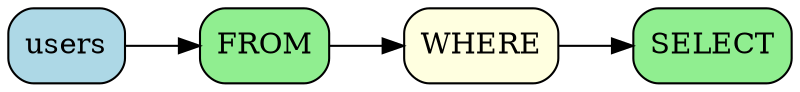

# sqloflow

A library and CLI tool for SQL visualization. Parse SQL strings and visualize data flow.

## Features

- 🎯 Two perspectives: operation-focused and schema-focused
- 📦 Available as both library and CLI
- 🌐 Works in both browser and Node.js
- 📸 Schema snapshot generation to track transformations

## Installation

```bash
npm install sqloflow
```

## CLI Usage

### Basic Usage

```bash
# Output Mermaid diagram to stdout
sqloflow "SELECT * FROM users"

# Output in JSON format
sqloflow -f json "SELECT * FROM users"

# Output as ASCII art
sqloflow -f ascii "SELECT * FROM users"

# Output as DOT format for Graphviz
sqloflow -f dot "SELECT * FROM users"

# Save to file
sqloflow -o diagram.md "SELECT * FROM users"

# Read from stdin
cat query.sql | sqloflow -f mermaid
```

### Options

```
-f, --format <format>     Output format: json, mermaid, ascii, dot (default: mermaid)
-o, --output <file>       Output to file instead of stdout
-d, --dialect <dialect>   SQL dialect: postgresql, mysql, sqlite, mariadb, transactsql
                         (default: postgresql)
-v, --view <view>         View type for json/dot: operation, schema (default: operation)
-h, --help               Show help message
```

### Examples

```bash
# Output JSON schema view with MySQL syntax
sqloflow -d mysql -f json -v schema "SELECT u.id, u.name, o.total FROM users u JOIN orders o ON u.id = o.user_id"

# Generate DOT file and convert to PNG
sqloflow -f dot "SELECT * FROM users" > query.dot
dot -Tpng query.dot -o query.png

# Quick ASCII visualization in terminal
sqloflow -f ascii "SELECT name, COUNT(*) FROM users GROUP BY name"

# Visualize complex query with Mermaid
sqloflow "
  WITH recent_orders AS (
    SELECT user_id, SUM(amount) as total
    FROM orders
    WHERE created_at >= CURRENT_DATE - INTERVAL '30 days'
    GROUP BY user_id
  )
  SELECT u.name, r.total
  FROM users u
  JOIN recent_orders r ON u.id = r.user_id
  ORDER BY r.total DESC
  LIMIT 10
"
```

## Library Usage

### Basic Usage

```typescript
import { parse, convert, render } from 'sqloflow';

// Parse SQL and convert to IR (Intermediate Representation)
const sql = 'SELECT id, name FROM users WHERE active = true';
const ast = parse(sql);
const ir = convert(ast);

// Render as Mermaid diagram
const mermaid = render(ir, { format: 'mermaid' });
console.log(mermaid);

// Render as JSON (operation-focused)
const jsonOp = render(ir, { format: 'json', jsonViewType: 'operation' });
console.log(jsonOp);

// Render as JSON (schema-focused)
const jsonSchema = render(ir, { format: 'json', jsonViewType: 'schema' });
console.log(jsonSchema);

// Render as DOT format
const dot = render(ir, { format: 'dot', jsonViewType: 'operation' });
console.log(dot);

// Render as ASCII art
const ascii = render(ir, { format: 'ascii' });
console.log(ascii);
```

### Using Different SQL Dialects

```typescript
import { parse, convert, render } from 'sqloflow';

// Parse with MySQL syntax
const ast = parse(sql, 'mysql');
const ir = convert(ast);
const result = render(ir, { format: 'mermaid' });
```

### API Reference

#### `parse(sql: string, dialect?: Dialect): AST[]`

Parses SQL string into Abstract Syntax Tree (AST).

- `sql`: SQL string to parse
- `dialect`: SQL dialect (optional)
  - `'postgresql'` (default)
  - `'mysql'`
  - `'sqlite'`
  - `'mariadb'`
  - `'transactsql'`

#### `convert(ast: AST[]): Graph`

Converts AST to Intermediate Representation (IR) graph structure.

#### `render(graph: Graph, options: RenderOptions): string`

Renders graph in specified format.

- `options.format`: Output format
  - `'json'`
  - `'mermaid'`
  - `'dot'`
  - `'ascii'`
- `options.jsonViewType`: View type (for JSON and DOT formats)
  - `'operation'`: Operation-focused view
  - `'schema'`: Schema-focused view

## Output Examples

### Mermaid


### ASCII Art

```
┌────────┐    ┌────────┐    ┌────────┐    ┌────────┐
│ users  │───▶│  FROM  │───▶│ WHERE  │───▶│ SELECT │
└────────┘    └────────┘    └────────┘    └────────┘
```

### DOT (Graphviz)



### JSON (Operation-focused)

```json
{
  "view": "operation",
  "nodes": [
    {
      "id": "node_0",
      "type": "relation",
      "label": "users"
    },
    {
      "id": "node_1",
      "type": "op",
      "label": "FROM",
      "sql": "FROM users"
    },
    {
      "id": "node_2",
      "type": "clause",
      "label": "WHERE"
    },
    {
      "id": "node_3",
      "type": "op",
      "label": "SELECT",
      "sql": "id, name"
    }
  ],
  "edges": [
    {
      "id": "edge_0",
      "type": "flow",
      "from": "node_0",
      "to": "node_1"
    },
    {
      "id": "edge_1",
      "type": "flow",
      "from": "node_1",
      "to": "node_2"
    },
    {
      "id": "edge_2",
      "type": "flow",
      "from": "node_2",
      "to": "node_3"
    }
  ]
}
```

## Examples

See the `examples/` directory for sample SQL queries and their visualizations:

```bash
cd examples
node generate.js  # Regenerate all examples
```

Generated files:
- `*.sql` - Source SQL queries
- `*_operation.dot` / `*_schema.dot` - DOT format files
- `*_operation.png` / `*_schema.png` - Rendered images
- `*.mmd` - Mermaid diagrams
- `*.txt` - ASCII art visualizations

## Supported SQL Statements

- SELECT statements (with JOIN, subqueries, CTEs)
- INSERT statements
- UPDATE statements
- DELETE statements
- CREATE TABLE statements (with schema extraction)
- ALTER TABLE statements
- Other basic SQL statements

## Development

```bash
# Install dependencies
npm install

# Build
npm run build

# Run tests
npm test

# Type checking
npm run type

# Development mode
npm run dev
```

## License

MIT

## Author

rot1024
